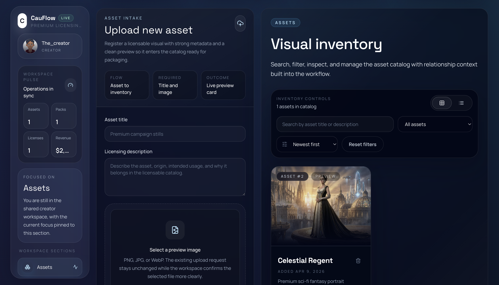
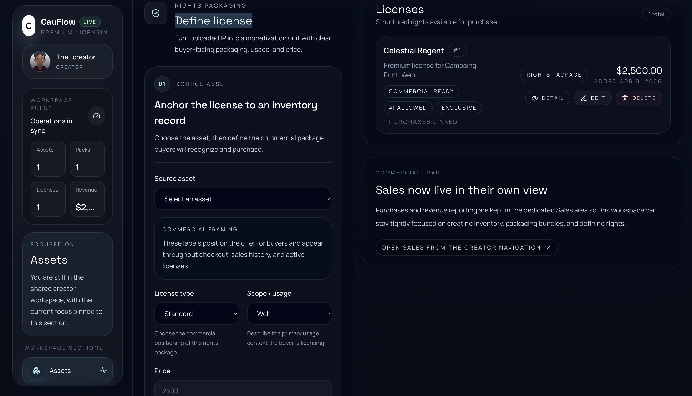
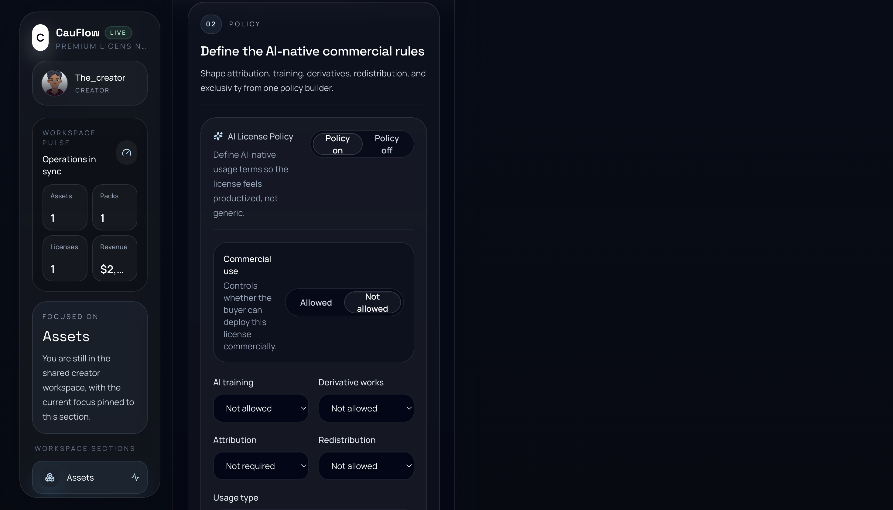
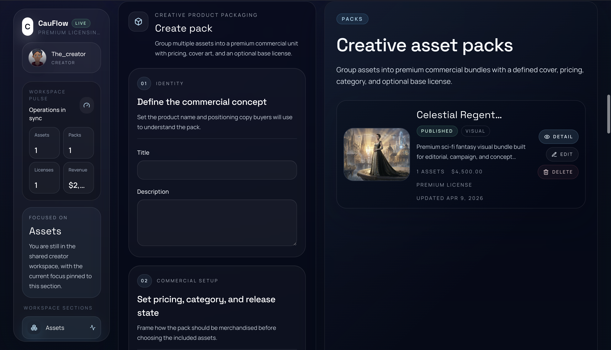
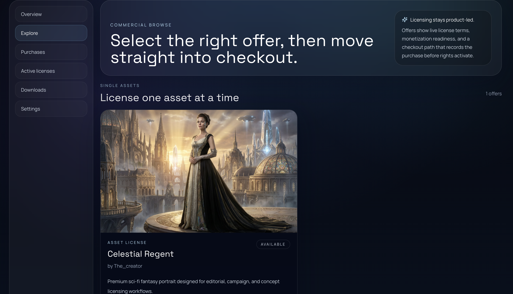
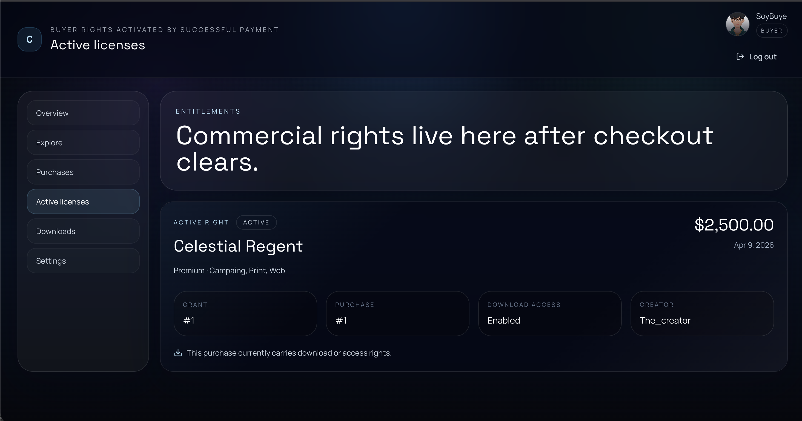

# CauFlow

Premium licensing infrastructure for AI-native assets.

CauFlow is a commercial licensing platform where creators can upload premium digital assets, define structured usage rights, package assets into licensable collections, and monetize access through buyer-facing checkout flows.

The product connects the full commercial trail:
- asset intake
- rights packaging
- AI-native policy configuration
- bundle creation
- buyer checkout
- purchase recording
- active license activation
- creator sales visibility

## What CauFlow does

CauFlow helps creators turn digital works into licensable commercial products.

With CauFlow, creators can:
- upload and manage visual assets
- define buyer-facing license packages
- configure AI-native commercial usage rules
- assemble premium packs
- publish offers to a buyer marketplace
- track purchases and sales outcomes

Buyers can:
- browse individual asset offers and bundles
- review license positioning and usage context
- complete checkout flows
- view purchases
- access active commercial rights after payment

## Core workflow

1. Creator uploads an asset
2. Creator defines a structured license
3. Creator configures AI-native policy terms
4. Creator optionally assembles a pack
5. Buyer discovers the offer in the marketplace
6. Buyer initiates checkout
7. Payment is recorded
8. Commercial rights activate after successful payment
9. Creator sees the sale in the sales view

## Product surfaces

### Creator workspace
A unified operating surface for:
- assets
- packs
- licenses
- commercial workflow preparation

### Buyer workspace
A dedicated buyer-facing surface for:
- marketplace exploration
- purchases
- active licenses
- downloads

### Commercial trail
CauFlow keeps payment state, purchase state, and entitlement state clearly separated so rights only activate after successful payment.

## Screenshots

### Creator flow

#### Upload asset

#### Define commercial license

#### Configure AI-native usage policy

#### Build premium asset packs

### Buyer flow

#### Explore individual asset offers

#### Explore bundled collections

#### Active commercial rights after checkout

### Creator
- Unified creator workspace for the asset-to-pack-to-license pipeline.
- Upload new asset into visual inventory.
- Define buyer-facing license packages.
- Configure AI-native commercial policy rules.
- Review commercial operating terms.
- Assemble premium asset packs.

### Buyer
- Buyer dashboard for purchased licenses and downloads.
- Marketplace view for individual asset licensing.
- Marketplace view for bundle licensing.
- Active license view after successful checkout.

## Status

CauFlow currently demonstrates an end-to-end commercial licensing flow across:
- creator asset intake
- creator licensing
- creator pack creation
- buyer marketplace browsing
- checkout state transition
- purchase recording
- active license activation
- creator sales visibility